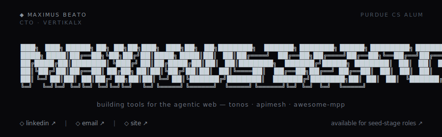
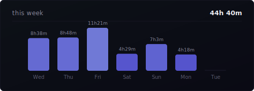

<picture>
  <source media="(prefers-color-scheme: dark)" srcset="assets/header.svg" />
  <source media="(prefers-color-scheme: light)" srcset="assets/header.svg" />
  
</picture>

  <a href="mailto:maximus.beato@gmail.com">email</a> · <a href="https://www.linkedin.com/in/maximus-beato/">linkedin</a> · <a href="https://mbeato.dev">site</a>

 

#### what i'm building

**[APIMesh](https://github.com/mbeato/APIMesh)** — 23 pay-per-call web analysis APIs + 16-tool MCP server with autonomous API generation. Security audits, SEO, tech stack detection. Dual payments via x402 + Stripe MPP. Self-deployed on Hetzner with Bun/Hono and Caddy. First-party service in the Stripe/Tempo MPP ecosystem. **1,000+ req/day at 99% uptime.**

**[Tonos](https://tonos.fyi)** — Voice profile API. Submit writing samples, get a structured voice profile back. Any app or AI agent calls it to generate messages that sound like you, not like AI. Bun + Hono + PostgreSQL + Claude structured outputs. Stripe billing + MCP server + OAuth.

**[awesome-mpp](https://github.com/mbeato/awesome-mpp)** — The community registry for Machine Payments Protocol — 180+ tools, SDKs, and services across 15+ chains.

#### at VertikalX

CTO leading a 3-engineer team building a sports athlete sponsorship platform — NestJS/GraphQL backend (250+ operations), React/Next.js web apps, React Native mobile app (Expo 53), deployed on AWS EKS with a 5-stage GitLab CI/CD pipeline. Serving 60+ athletes globally.

#### stack

  &nbsp;&nbsp;
  &nbsp;&nbsp;
  &nbsp;&nbsp;
  &nbsp;&nbsp;
  &nbsp;&nbsp;
  &nbsp;&nbsp;
  &nbsp;&nbsp;
  &nbsp;&nbsp;
  &nbsp;&nbsp;
  

  &nbsp;&nbsp;
  &nbsp;&nbsp;
  &nbsp;&nbsp;
  &nbsp;&nbsp;
  &nbsp;&nbsp;
  &nbsp;&nbsp;
  &nbsp;&nbsp;
  &nbsp;&nbsp;
  &nbsp;&nbsp;
  

#### this week

  

 

  building something at a seed-stage company? <a href="mailto:maximus.beato@gmail.com">i'd love to chat</a>

