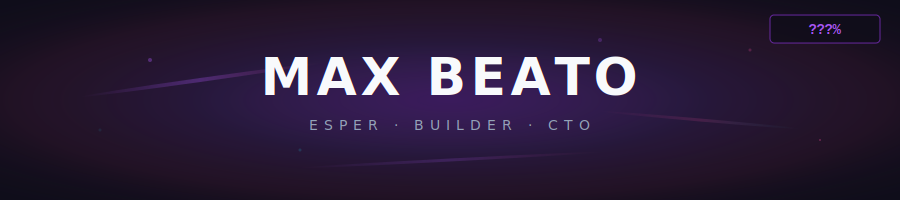

  

  CS @ Purdue (May 2026) · CTO @ <a href="https://vtxathlete.com">VertikalX</a> · building tools for the agentic web
    
  
  
  

 

 

## spirits & such consultation office

> *"if you have time to think of a beautiful end, then live beautifully until the end."*

<table>
<tr>
<td width="60%">

**[APIMesh](https://github.com/mbeato/APIMesh)** &nbsp; 

23 pay-per-call web analysis APIs + 16-tool MCP server with autonomous API generation. Security audits, SEO, tech stack detection. Dual payments via x402 + Stripe MPP. Self-deployed on Hetzner with Bun/Hono and Caddy. First-party service in the Stripe/Tempo MPP ecosystem.

**1,000+ req/day at 99% uptime.**

</td>
<td width="40%" align="center">

`TypeScript` `Bun` `Hono` `Caddy` 
`x402` `Stripe MPP` `MCP` 
`Hetzner` `OpenAPI`

</td>
</tr>
<tr>
<td width="60%">

**[Tonos](https://tonos.apimesh.xyz)** &nbsp; 

Voice profile API. Submit writing samples, get a structured voice profile back. Any app or AI agent calls it to generate messages that sound like you, not like AI. Stripe billing, MCP server, OAuth.

</td>
<td width="40%" align="center">

`Bun` `Hono` `PostgreSQL` 
`Claude` `Stripe` `OAuth`

</td>
</tr>
<tr>
<td width="60%">

**[awesome-mpp](https://github.com/mbeato/awesome-mpp)** &nbsp;  &nbsp; 

The community registry for Machine Payments Protocol — 180+ tools, SDKs, and services across 15+ chains.

</td>
<td width="40%" align="center">

`open source` `registry` 
`agent payments`

</td>
</tr>
</table>

 

 

## body improvement club &nbsp; ( tech stack )

 

 

## the awakening lab &nbsp; ( at VertikalX )

> *leading a 3-engineer team building a sports athlete sponsorship platform*

`NestJS/GraphQL backend (250+ operations)` · `React/Next.js web apps` · `React Native mobile (Expo 53)` · `AWS EKS` · `5-stage GitLab CI/CD` · `60+ athletes globally`

 

 

## ???% &nbsp; ( stats )

  <picture>
    <source media="(prefers-color-scheme: dark)" srcset="https://github-readme-stats.vercel.app/api?username=mbeato&show_icons=true&bg_color=0F0D1A&title_color=A855F7&text_color=C9D1D9&icon_color=EC4899&border_color=7B2FBE&hide_border=false&hide_title=true&count_private=true" />
    <source media="(prefers-color-scheme: light)" srcset="https://github-readme-stats.vercel.app/api?username=mbeato&show_icons=true&bg_color=F8FAFC&title_color=7B2FBE&text_color=1E1B2E&icon_color=EC4899&border_color=A855F7&hide_border=false&hide_title=true&count_private=true" />
    
  </picture>
  &nbsp;&nbsp;
  <picture>
    <source media="(prefers-color-scheme: dark)" srcset="https://github-readme-stats.vercel.app/api/top-langs/?username=mbeato&layout=compact&bg_color=0F0D1A&title_color=A855F7&text_color=C9D1D9&border_color=7B2FBE&hide_border=false&langs_count=6" />
    <source media="(prefers-color-scheme: light)" srcset="https://github-readme-stats.vercel.app/api/top-langs/?username=mbeato&layout=compact&bg_color=F8FAFC&title_color=7B2FBE&text_color=1E1B2E&border_color=A855F7&hide_border=false&langs_count=6" />
    
  </picture>

 

 

  <i>"your life won't change unless you make the effort to change it."</i> — reigen arataka
    
  building something at a seed-stage company? <a href="mailto:maximus.beato@gmail.com">i'd love to chat</a>

