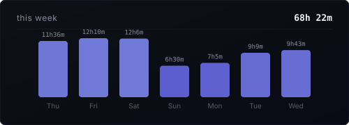

<picture>
  <source media="(prefers-color-scheme: dark)" srcset="assets/header.svg?v=4" />
  <source media="(prefers-color-scheme: light)" srcset="assets/header.svg?v=4" />
  
</picture>

 

#### what i'm building

**[recense](https://github.com/mbeato/recense)** — Brain-inspired memory engine for AI agents — learns schemas and corrects beliefs in place instead of accumulating stale duplicates. Runs as the memory layer behind my own agent setup.

 **[Tonos](https://tonos.fyi)** — Voice profile API. Submit writing samples, get a structured voice profile back. Any app or AI agent calls it to generate messages that sound like you, not like AI. Bun + Hono + PostgreSQL + Claude structured outputs. Stripe billing + MCP server + OAuth 2.1.

**[APIMesh](https://github.com/mbeato/APIMesh)** — Built 23 web analysis APIs + a 16-tool MCP server with autonomous API generation: security audits, SEO, tech-stack detection. Dual payments via x402 + Stripe MPP, self-deployed on Hetzner with Bun/Hono behind Caddy. Ran 1,000+ req/day at 99% uptime.

**[jobfill](https://github.com/mbeato/jobfill)** — Self-hosted job-application assistant: a local helper plus a Chrome extension that maps and fills application forms from your own profile. Never auto-submits.

**[stitch](https://github.com/mbeato/stitch)** — Browser-based video editor — edit by editing the transcript. Local Whisper, WebGL2 shaders, face-tracked reframe, multi-track timeline, all client-side.

**[awesome-mpp](https://github.com/mbeato/awesome-mpp)** — The community registry for Machine Payments Protocol — 180+ tools, SDKs, and services across 15+ chains.

#### at VertikalX

CTO leading a 3-engineer team building a sports athlete sponsorship platform — NestJS/GraphQL backend (250+ operations), React/Next.js web apps, React Native mobile app (Expo 53), deployed on AWS EKS with a 5-stage GitLab CI/CD pipeline. Serving 60+ athletes globally.

#### how i work

Agentic, context-engineering workflow — reusable skills, durable project context, and verification loops over one-off prompting. The tooling I built to work this way:

**[contextscope](https://github.com/mbeato/contextscope)** — CLI + local dashboard auditing Claude Code's per-turn token context (skills, agents, commands, hooks, MCP), with toggle-based control to cut what you don't use. On npm as `@mbeato/contextscope`.

**[anti-slop-design](https://github.com/mbeato/anti-slop-design)** — slash-command suite generating 3 structurally distinct design variants of any component, rendered via Playwright and auto-scored on a 6-dimension anti-slop rubric against a local 281-app corpus.

#### services

#### this week

  

 

  building something at a seed-stage company? <a href="mailto:maximus.beato@gmail.com">i'd love to chat</a>

